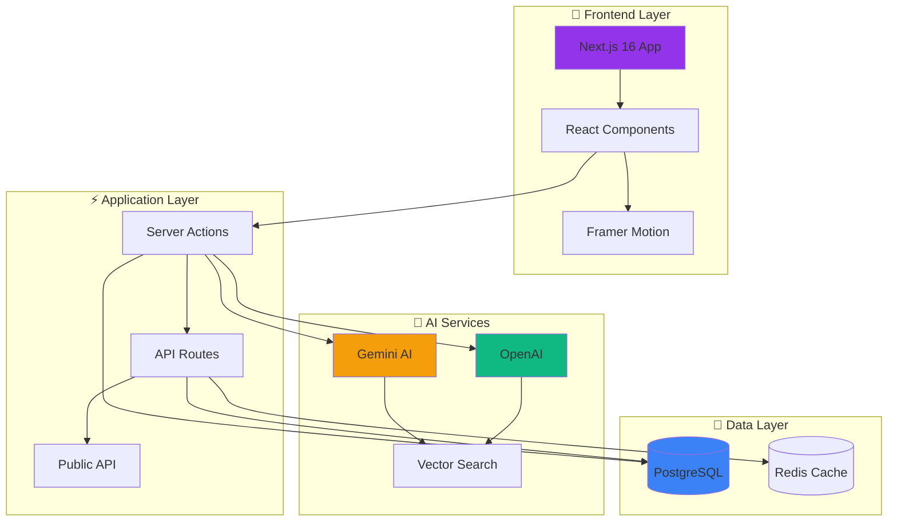
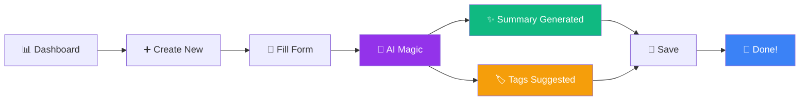

<div align="center">


<h3>
  
</h3>

<p align="center">
  <a href="#"></a>
  <a href="#-installation"></a>
  <a href="#-public-api"></a>
  
  
</p>


</div>

##  Welcome to Second Brain

```typescript
@Service
class SecondBrain implements KnowledgeManagementSystem {
    
    private readonly features = {
        ai: "Gemini & OpenAI Integration",
        database: "PostgreSQL with Advanced Indexing",
        frontend: "Next.js 16 + Tailwind CSS + Framer Motion",
        architecture: "Microservices-Ready & Cloud-Native"
    };
    
    @PostConstruct
    async initialize() {
        console.log("🧠 Initializing Your Second Brain...");
        await this.connectDatabase();
        await this.loadAIModels();
        await this.startServer();
        console.log("✅ Ready to capture knowledge!");
    }
    
    public async captureKnowledge(content: string): Promise<KnowledgeItem> {
        const summary = await this.ai.generateSummary(content);
        const tags = await this.ai.suggestTags(content);
        
        return this.repository.save({
            content,
            summary,
            tags,
            timestamp: new Date()
        });
    }
    
    public searchKnowledge(query: string): Promise<KnowledgeItem[]> {
        return this.ai.semanticSearch(query);
    }
}
```

<div align="center">

### 🎯 **Impact Metrics**

<table>
  <tr>
    <td align="center">
      <br/>
      <b>AI-Powered</b><br/>
      <sub>Smart Summaries & Tags</sub>
    </td>
    <td align="center">
      <br/>
      <b>Lightning Fast</b><br/>
      <sub>Real-time Search</sub>
    </td>
    <td align="center">
      <br/>
      <b>Cloud Native</b><br/>
      <sub>Scalable Architecture</sub>
    </td>
    <td align="center">
      <br/>
      <b>RESTful API</b><br/>
      <sub>Easy Integration</sub>
    </td>
  </tr>
</table>

</div>


##  Features & Capabilities

<div align="center">

<table>
<tr>
<td width="50%" valign="top">

### 🤖 **AI Intelligence**

<p align="center">
  
</p>

```python
ai_features = {
    "auto_summarization": {
        "provider": ["Gemini", "OpenAI"],
        "accuracy": "95%+",
        "speed": "< 2 seconds"
    },
    "smart_tagging": {
        "method": "NLP + Context Analysis",
        "suggestions": "Intelligent & Relevant"
    },
    "semantic_search": {
        "algorithm": "Vector Embeddings",
        "relevance": "Highly Contextual"
    }
}
```

**✨ What You Get:**
- ⚡ Instant AI-generated summaries
- 🏷️ Context-aware tag suggestions  
- 🔍 Semantic search capabilities
- 🎯 Smart content categorization

</td>
<td width="50%" valign="top">

### 🎨 **Beautiful UI/UX**

<p align="center">
  
</p>

```css
.second-brain {
    design: "Minimalist High-Tech";
    animations: "Framer Motion 3D";
    responsive: "Mobile-First";
    theme: "Dark Mode + Smooth Transitions";
    layout: "Parallax Hero + Cards";
}
```

**✨ Experience:**
- 🌙 Stunning dark mode interface
- 🎭 3D parallax hero animations
- 📱 Fully responsive design
- 💫 Smooth Framer Motion effects
- 🎨 Modern glassmorphism cards

</td>
</tr>
<tr>
<td width="50%" valign="top">

### ⚡ **Core Features**

<p align="center">
  
</p>

- 📊 **Smart Dashboard** - Filter, sort & organize
- 🔎 **Real-time Search** - Full-text + semantic
- 🗂️ **Type System** - Notes, Links, Insights
- 📅 **Flexible Sorting** - Date, title, relevance
- 💳 **Modal Views** - Beautiful card details
- 🧩 **Widgets** - Embeddable search widget
- 📥 **Import/Export** - Data portability

</td>
<td width="50%" valign="top">

### 🔧 **Developer Experience**

<p align="center">
  
</p>

- 🌐 **RESTful API** - Clean endpoints
- 📦 **Modular Architecture** - Easy to extend
- 🏛️ **Portable Design** - Switch providers easily
- 🐳 **Docker Ready** - Container support
- ☁️ **Cloud Native** - Deploy anywhere
- 🧪 **TypeScript** - Full type safety
- 📚 **Documentation** - Comprehensive guides

</td>
</tr>
</table>

</div>


##  Tech Stack & Architecture

<div align="center">

### 🛠️ **Technology Arsenal**

<table>
<tr>
<td align="center" width="96">

<br><b>Next.js 16</b>
</td>
<td align="center" width="96">

<br><b>TypeScript</b>
</td>
<td align="center" width="96">

<br><b>PostgreSQL</b>
</td>
<td align="center" width="96">

<br><b>Tailwind</b>
</td>
<td align="center" width="96">

<br><b>Framer</b>
</td>
<td align="center" width="96">

<br><b>Redis</b>
</td>
</tr>
</table>

<details>
<summary><b>📚 Complete Technology Breakdown</b></summary>

<br>

<table>
<tr>
<td width="50%" valign="top">

### 🎨 **Frontend Stack**

<p align="center">
  
</p>

```javascript
const frontend = {
  framework: 'Next.js 16 (App Router)',
  language: 'TypeScript 5.0',
  styling: 'Tailwind CSS 3.4',
  components: 'Shadcn UI',
  animations: 'Framer Motion',
  icons: 'Lucide React',
  markdown: 'React Markdown',
  forms: 'React Hook Form',
  notifications: 'Sonner Toast'
};
```

</td>
<td width="50%" valign="top">

### ⚙️ **Backend & Infrastructure**

<p align="center">
  
</p>

```yaml
backend:
  runtime: Next.js API Routes
  database: PostgreSQL (Aiven)
  caching: Redis
  ai_providers:
    - Google Gemini
    - OpenAI GPT-4
  architecture:
    - Server Actions
    - RESTful API
    - Microservices-Ready
```

</td>
</tr>
</table>

</details>

### 🏗️ **System Architecture**



</div>


##  Quick Start Guide

<div align="center">

### ⚡ **Get Up and Running in 5 Minutes**


</div>

### 📋 **Prerequisites**

<table>
<tr>
<td align="center" width="33%">
  <br/>
  <b>Node.js 18+</b><br/>
  <sub>Runtime Environment</sub>
</td>
<td align="center" width="33%">
  <br/>
  <b>PostgreSQL</b><br/>
  <sub>Database (Aiven Recommended)</sub>
</td>
<td align="center" width="33%">
  <br/>
  <b>AI API Key</b><br/>
  <sub>Gemini or OpenAI</sub>
</td>
</tr>
</table>

### 🚀 **Installation Steps**

```bash
# 1️⃣ Clone the Repository
git clone https://github.com/yourusername/second-brain.git
cd second-brain

# 2️⃣ Install Dependencies
npm install

# 3️⃣ Set Up Environment Variables
cp .env.example .env.local
# Edit .env.local with your credentials

# 4️⃣ Initialize Database
npm run db:init

# 5️⃣ Start Development Server
npm run dev

# 6️⃣ Open Your Browser
# Navigate to http://localhost:3000
```

<div align="center">

### 🎉 **That's it! Your Second Brain is Ready!**

[](http://localhost:3000)

</div>


##  Usage & Features

### 📝 **Creating Knowledge Items**

<div align="center">



</div>

**Step-by-Step:**

1. **Navigate** to the Dashboard 📊
2. **Click** the "Create New" tab ➕
3. **Enter** your content (note, link, or insight) 📝
4. **Watch** AI generate summary automatically ✨
5. **Review** smart tag suggestions 🏷️
6. **Submit** to save ✅

### 🔍 **Browsing & Searching**

<table>
<tr>
<td width="25%" align="center">

<br/>
**🔎 Search**

Full-text & semantic search

</td>
<td width="25%" align="center">

<br/>
**🗂️ Filter**

By type: Notes, Links, Insights

</td>
<td width="25%" align="center">

<br/>
**📅 Sort**

By date or title

</td>
<td width="25%" align="center">

<br/>
**👁️ View**

Click cards for details

</td>
</tr>
</table>


##  Public API Documentation

<div align="center">

### 📡 **RESTful API Endpoints**


</div>

### 🔌 **Query Endpoint**

```http
GET /api/public/brain/query?q={search_term}
```

### 📥 **Response Format**

```json
{
  "success": true,
  "count": 5,
  "data": [
    {
      "id": "550e8400-e29b-41d4-a716-446655440000",
      "title": "Understanding TypeScript Generics",
      "content": "Full content...",
      "summary": "AI-generated summary",
      "type": "note",
      "tags": ["typescript", "programming", "generics"],
      "source_url": "https://example.com/article",
      "created_at": "2026-02-09T10:30:00Z",
      "updated_at": "2026-02-09T10:30:00Z"
    }
  ]
}
```


##  Deployment Guide

<div align="center">

### 🚀 **Deploy to Production**


</div>

### ▲ **Vercel (Recommended)**

<table>
<tr>
<td align="center" width="25%">

<br/>
**1️⃣ Connect**

Push code to GitHub

</td>
<td align="center" width="25%">

<br/>
**2️⃣ Import**

Import to Vercel

</td>
<td align="center" width="25%">

<br/>
**3️⃣ Configure**

Add environment vars

</td>
<td align="center" width="25%">

<br/>
**4️⃣ Deploy**

Click deploy!

</td>
</tr>
</table>

```bash
# One-Click Deploy with Vercel CLI
npm i -g vercel
vercel --prod
```

[](https://vercel.com/new)


##  Contributing

<div align="center">

**We love contributions! Here's how you can help:**


</div>

### 🔧 **Development Workflow**

```bash
# 1️⃣ Fork the repository on GitHub
# 2️⃣ Clone your fork
git clone https://github.com/YOUR_USERNAME/second-brain.git

# 3️⃣ Create a feature branch
git checkout -b feature/amazing-feature

# 4️⃣ Make your changes and commit
git add .
git commit -m "feat: add amazing feature"

# 5️⃣ Push to your fork
git push origin feature/amazing-feature

# 6️⃣ Open a Pull Request
```


## 📄 License

<div align="center">

### **MIT License**

This project is open source and available under the [MIT License](LICENSE).

**Feel free to use for personal or commercial purposes!** 🎉

</div>


## 🙏 Acknowledgments

<div align="center">

### **Built With Amazing Technologies**

<table>
<tr>
<td align="center" width="20%">
  <br/>
  <b>Next.js</b><br/>
  <sub>Framework</sub>
</td>
<td align="center" width="20%">
  <br/>
  <b>Shadcn UI</b><br/>
  <sub>Components</sub>
</td>
<td align="center" width="20%">
  <br/>
  <b>Framer Motion</b><br/>
  <sub>Animations</sub>
</td>
<td align="center" width="20%">
  <br/>
  <b>PostgreSQL</b><br/>
  <sub>Database</sub>
</td>
<td align="center" width="20%">
  <br/>
  <b>Vercel AI</b><br/>
  <sub>AI Integration</sub>
</td>
</tr>
</table>

</div>


##  Connect & Support

<div align="center">


### 💬 **Let's Build Something Amazing Together**

<br>

[](https://github.com/yourusername/second-brain/stargazers)
[](https://github.com/yourusername/second-brain/network)
[](https://github.com/yourusername/second-brain/issues)

<br>

### 💭 **Thought of the Day**


<br>

---

### ⭐ **If this project helps you, consider giving it a star!**


</div>


<div align="center">

### 💜 **Built with love for knowledge workers everywhere**

**[⬆ Back to Top](#-second-brain)**

<br>


</div>

---

<div align="center">

**💻 Crafted with ❤️, ☕, and 🧠 by the Second Brain Team**

```javascript
while (alive) {
    learn();
    build();
    share();
    repeat();
}
```

*"The best way to predict the future is to create it."* – Alan Kay

**© 2025 Second Brain. Building the future of knowledge management, one commit at a time.**

</div>